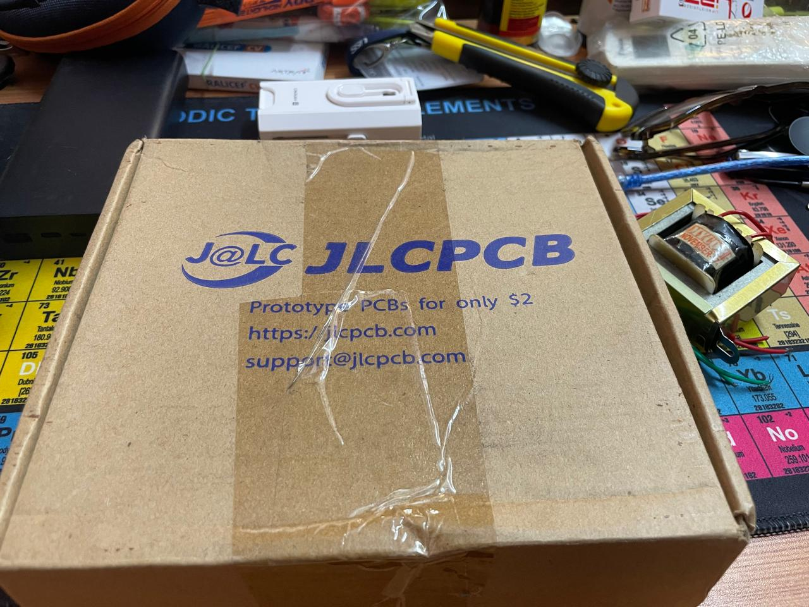
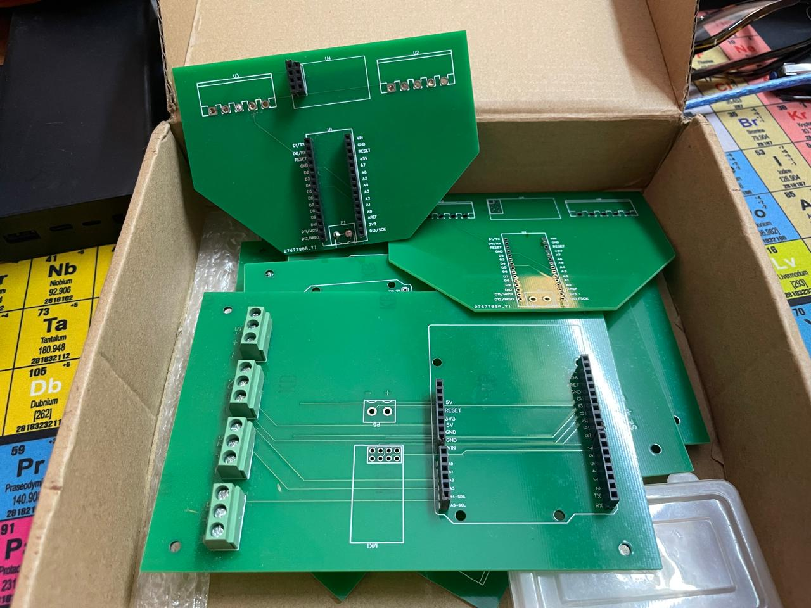
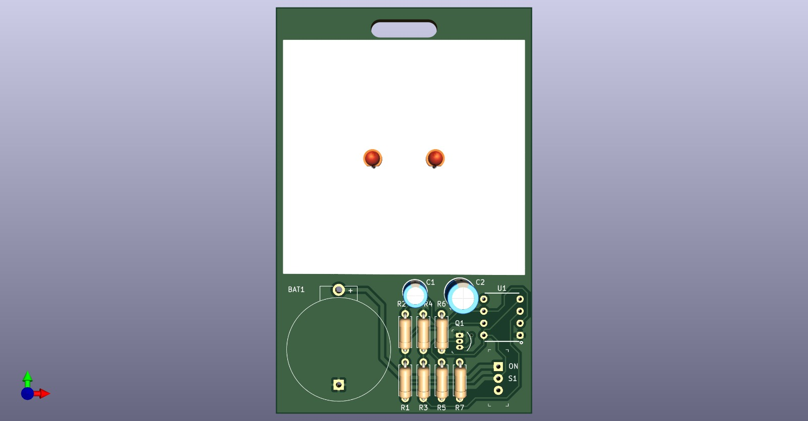
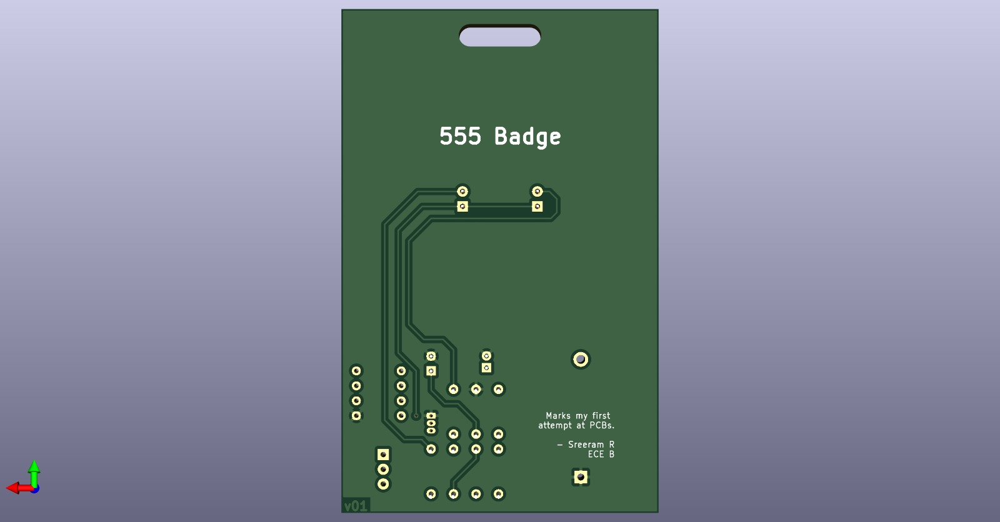
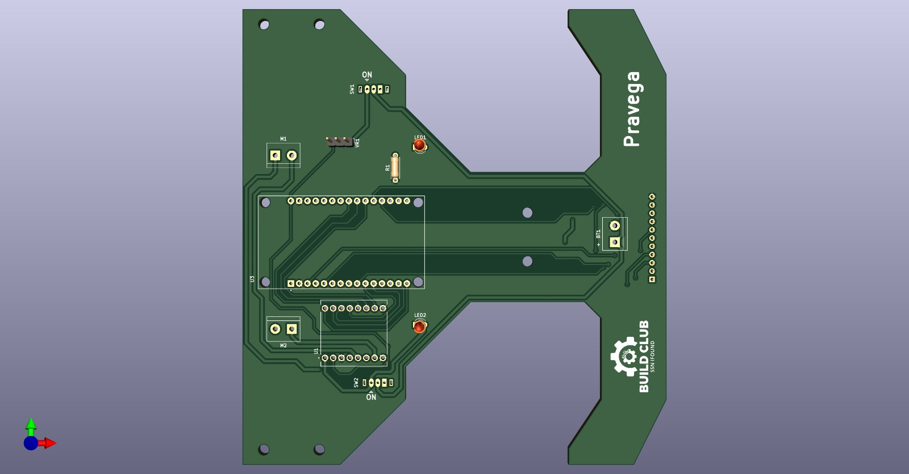
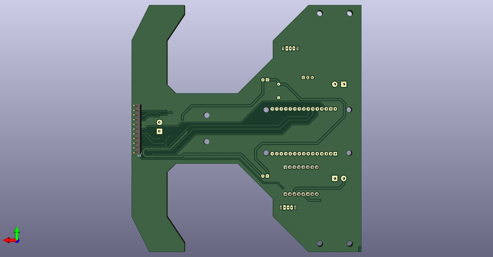
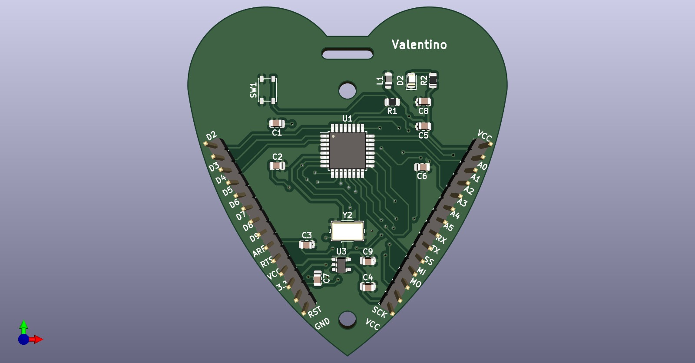
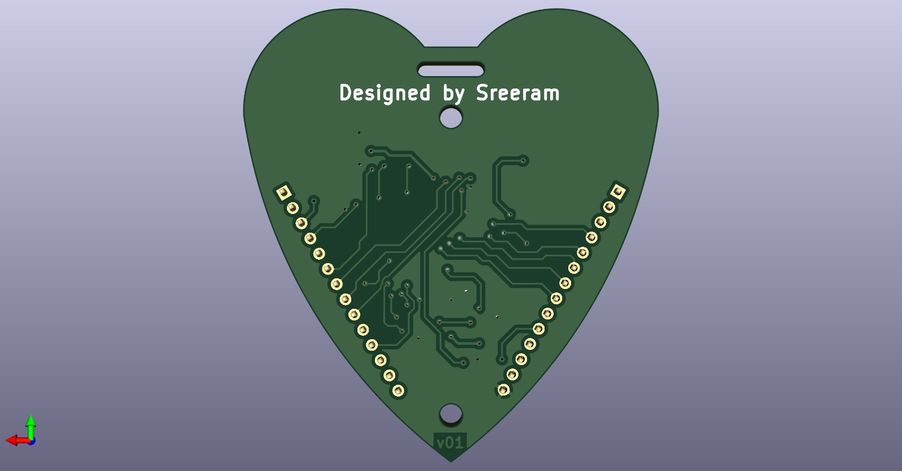

# KiCad Projects

An archive for all my KiCad project folders for various projects I've been working on. Find more about each of these KiCad projects on their respective repos if they exist wherein I have shared about the project itself, here's a quick overview of my KiCad designs.

## Overview

Several attempts were made by me in the past to try out designing and printing PCBs for my personal high school projects. After constant yapping and getting my dad on-board for my PCB fab through JLC PCB, results were pretty bad cuz of my PCB design skills. Some pictures for context. Fast forwarding now, I understood high-school me was pretty dumb, or always that has been the case and I am living in delulu.

 

&nbsp;

 

With all that being said here are some of my recent projects.

### [1. 555 ID Badge](https://www.youtube.com/playlist?list=PLEBQazB0HUyR24ckSZ5u05TZHV9khgA1O)

This project served as a great introduction for me in KiCad. I am grateful to Digikey and Shawn Hymel for their open-source project (resources below). Through this, I learned to create custom footprints, read datasheets, search for specific IC components for projects, and design according to the capabilities of the service provider.

 

&nbsp;

 

### [2. Pravega - The Line Follower](https://github.com/Sreeram-Ramesh/Pravega)

Working on an agile line follower bot utilizing the PID control algorithm. This project is being developed in association with the Build Club SSN college. Looking to quickly realize it and bring it on the competitive stage.

 

&nbsp;

 

### 3. Valentino

A development board, similar to the arduino, based on the ATMEGA328 chip, design brought to life on the Valentine's day. Pretty rudimentary design. Looking forward to my microcontrollers course in semester 4. Hoping to develop more on this and have my custom microcontroller board made one day. If you have got any resources you think can help me kindly let me know. Here are some specs:

- Clock Speed: 16 MHz
- Supports SPI and UART
- Can be worn as a locket
- 16 GPIO pins in total

 

&nbsp;

 

## Feedback

If you have any feedback for my work, or maybe would like to thank me for any of my custom footprints that you somehow found useful, or have some useful resources, please mail it to my [email](mailto:vgpsreerama@gmail.com).

## Acknowledgements

 - [Digikey India](https://www.digikey.in/)
 - [KiCad Tutorials](https://www.youtube.com/playlist?list=PLEBQazB0HUyR24ckSZ5u05TZHV9khgA1O)
 - [Shawn Hymel](https://www.linkedin.com/in/shawnhymel/) - For being such a treat to watch and learn, have been following him since middle school, notable influence in my academic journey.
 - [PCB Manufacturing India](https://robu.in/product/online-pcb-manufacturing-service/)

## Licenses

- [MIT](https://choosealicense.com/licenses/mit/)
- [CC BY 4.0](https://creativecommons.org/licenses/by/4.0/)

